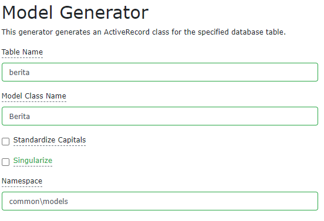

# Pembuatan Blog - Part 1

## Konfigurasi Database

-   Pastikan database sudah terinstall menggunakan XAMPP atau yang lainnya
-   Buat database dengan nama `uas_blog`
-   Buka file `common/config/main-local.php` dan edit seperti konfigurasi dibawah

    ```php
    'urlManager' => [
        'enablePrettyUrl' => true,
        'showScriptName' => false
    ],
    'db' => [
        'class' => 'yii\db\Connection',
        'dsn' => 'mysql:host=localhost;dbname=uas_blog',
        'username' => 'root',
        'password' => '',
        'charset' => 'utf8',
    ],
    ```

## Membuat file migrasi

-   Untuk membuat file migrasi di **Yii Framework** hanya dengan mengeksekusi perintah
    ```bash
    > php yii migrate/create <nama>
    ```
-   Maka akan otomatis file terbuat di `console/migrations`
-   Buat file migrasi untuk table **Berita**
    ```bash
    > php yii migrate/create create_berita_table
    ```
-   Buka file **create_berita_table** dan edit fungsi `safeUp` seperti di bawah
    ```php
    public function safeUp()
    {
        $this->createTable('{{%berita}}', [
            'id_berita' => $this->primaryKey(11),
            'judul' => $this->string(),
            'isi_berita' => $this->text(),
            'id_kategori' => $this->integer(11),
            'jml_baca' => $this->integer(11),
            'id_user' => $this->integer(11),
            'date_created' => $this->timestamp()
        ]);
    }
    ```
-   Buat file migrasi untuk table **Kategori**
    ```bash
    > php yii migrate/create create_kategori_table
    ```
-   Buka file **create_kategori_table** dan edit fungsi `safeUp` seperti di bawah
    ```php
    public function safeUp()
    {
        $this->createTable('{{%kategori}}', [
            'id_kategori' => $this->primaryKey(11),
            'kategori' => $this->string(),
            'ket' => $this->string()
        ]);
    }
    ```
-   Buat file migrasi untuk table **Komentar**
    ```bash
    > php yii migrate/create create_komentar_table
    ```
-   Buka file **create_komentar_table** dan edit fungsi `safeUp` seperti di bawah
    ```php
    public function safeUp()
    {
        $this->createTable('{{%komentar}}', [
            'id_komentar' => $this->primaryKey(11),
            'id_berita' => $this->integer(11),
            'nama' => $this->string(100),
            'email' => $this->string(100),
            'isi_komentar' => $this->text(),
            'date_created' => $this->timestamp()
        ]);
    }
    ```
-   Buat file migrasi untuk menambahkan foreign key untuk semua table
    ```bash
    > php yii migrate/create add_foreign_key
    ```
-   Buka file **add_foreign_key** dan edit fungsi `safeUp` dan `safeDown` seperti di bawah

    ```php
    public function safeUp()
    {
        $this->addForeignKey(
            'fk-berita-id_kategori',
            'berita',
            'id_kategori',
            'kategori',
            'id_kategori',
            'CASCADE',
            'CASCADE'
        );

        $this->addForeignKey(
            'fk-komentar-id_berita',
            'komentar',
            'id_berita',
            'berita',
            'id_berita',
            'CASCADE',
            'CASCADE'
        );

        $this->addForeignKey(
            'fk-berita-id_user',
            'berita',
            'id_user',
            'zukron_alviandy_r_1811081030',
            'id',
            'CASCADE',
            'CASCADE'
        );
    }
    ```

    ```php
    public function safeDown()
    {
        $this->dropForeignKey('fk-berita-id_kategori', 'berita');

        $this->dropForeignKey('fk-komentar-id_berita', 'komentar');

        $this->dropForeignKey('fk-berita-id_user', 'berita');
    }
    ```

-   Modifikasi tabel **User** yang berada pada file migrasi **init** dan ubah nama table tersebut dengan **zukron_alviandy_r_1811081030** pada fungsi `up`

    ```php
    $this->createTable('{{%zukron_alviandy_r_1811081030}}', [
        'id' => $this->primaryKey(),
        'nama_depan' => $this->string(),
        'nama_belakang' => $this->string(),
        'username' => $this->string()->notNull()->unique(),
        'auth_key' => $this->string(32)->notNull(),
        'password_hash' => $this->string()->notNull(),
        'password_reset_token' => $this->string()->unique(),
        'email' => $this->string()->notNull()->unique(),

        'status' => $this->smallInteger()->notNull()->defaultValue(10),
        'created_at' => $this->integer()->notNull(),
        'updated_at' => $this->integer()->notNull(),
    ], $tableOptions);
    ```

-   Modifikasi model **User** di `common/models` dan ubah pada fungsi `tableName`
    ```php
    public static function tableName()
    {
        return '{{%zukron_alviandy_r_1811081030}}';
    }
    ```
-   Modifikasi file migrasi **add_verification_token** dan ubah pada fungsi `up` dan `down`
    ```php
    public function up()
    {
        $this->addColumn('{{%zukron_alviandy_r_1811081030}}', 'verification_token', $this->string()->defaultValue(null));
    }
    ```
    ```php
    public function down()
    {
        $this->dropColumn('{{%zukron_alviandy_r_1811081030}}', 'verification_token');
    }
    ```
-   Setelah semua file migrasi dan modifikasi nama table maka tinggal kita lakukan migrasi ke database dengan cara
    ```bash
    > php yii migrate
    ```
-   Jika berhasil migrasi akan muncul seperti ini

    

-   Maka semua file migrasi yang telah dibuat akan menjadi tabel-tabel di database
-   Berikut hasil dari ERD yang di generate otomatis menggunakan **Data Grip**

    

## Membuat model menggunakan GII

-   Buka browser dan akses `/gii` dan pilih **Model Generator**
-   Buat model **Berita**

    

-   Setelah model berita dibuat, kita lakukan sedikit modifikasi pada model **Berita** di `common/models`
-   Hapus line berikut
    ```php
    [['id_user'], 'exist', 'skipOnError' => true, 'targetClass' => User::class, 'targetAttribute' => ['id_user' => 'id']],
    ```
-   Modifikasi pada fungsi `getUser`

    ```php
    public function getUser()
    {
        return $this->hasOne(User::class, ['id' => 'id_user']);
    }
    ```

-   Buat model **Kategori**

    

-   Buat model **Komentar**

    

## Membuat CRUD menggunakan GII

-   Buka browser dan akses `/gii` dan pilih **CRUD Generator**
-   Membuat CRUD **Berita**

    

-   Membuat CRUD **Kategori**

    

-   Membuat CRUD **Komentar**

    

-   Membuat CRUD **User**

    
