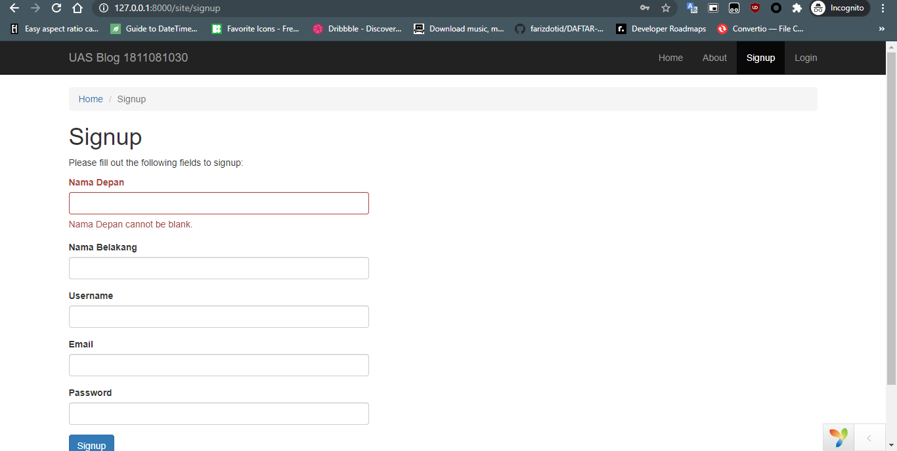
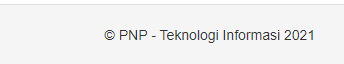

# Pembuatan Blog - Part 2

## Membuat halaman Sign Up

-   Buka file **signup.php** di direktori `frontend/views/site`
-   Dan edit form menjadi seperti di bawah

    ```php
    <?php $form = ActiveForm::begin(['id' => 'form-signup']); ?>

    <?= $form->field($model, 'nama_depan')->textInput(['autofocus' => true]) ?>

    <?= $form->field($model, 'nama_belakang') ?>

    <?= $form->field($model, 'username') ?>

    <?= $form->field($model, 'email') ?>

    <?= $form->field($model, 'password')->passwordInput() ?>

    <div class="form-group">
        <?= Html::submitButton('Signup', ['class' => 'btn btn-primary', 'name' => 'signup-button']) ?>
    </div>

    <?php ActiveForm::end(); ?>
    ```

-   Buka file **SignupForm.php** di `frontend/models` tambahkan properti

    ```php
    public $nama_depan;
    public $nama_belakang;
    public $username;
    public $email;
    public $password;
    ```

-   Edit pada fungsi `rules` dengan menambahkan beberapa validasi

    ```php
    ['nama_depan', 'trim'],
    ['nama_depan', 'required'],

    ['nama_belakang', 'trim'],
    ['nama_belakang', 'required'],
    ```

-   Edit pada fungsi `signup` seperti di bawah. Karena kita tidak memakai verifikasi email, maka untuk variable `status` ubah default menjadi 10 (Active User) dan pada return melakukan aksi mengirim email.

    ```php
    public function signup()
    {
        if (!$this->validate()) {
            return null;
        }

        $user = new User();
        $user->nama_depan = $this->nama_depan;
        $user->nama_belakang = $this->nama_belakang;
        $user->username = $this->username;
        $user->email = $this->email;
        $user->status = 10;
        $user->setPassword($this->password);
        $user->generateAuthKey();
        $user->generateEmailVerificationToken();
        return $user->save();
    }
    ```

-   Maka jika kita mengakses `site/signup` akan tampil seperti ini

    

## Mengedit footer

-   Buka file **main.php** di direktori `frontend/views/layout` dan edit pada bagian footer

    ```html
    <footer class="footer">
        <div class="container">
            <p class="pull-left">
                &copy; PNP - Teknologi Informasi
                <?= date('Y') ?>
            </p>

            <p class="pull-right"><?= Yii::powered() ?></p>
        </div>
    </footer>
    ```

-   Maka untuk bagian footer akan berubah menjadi seperti ini

    
