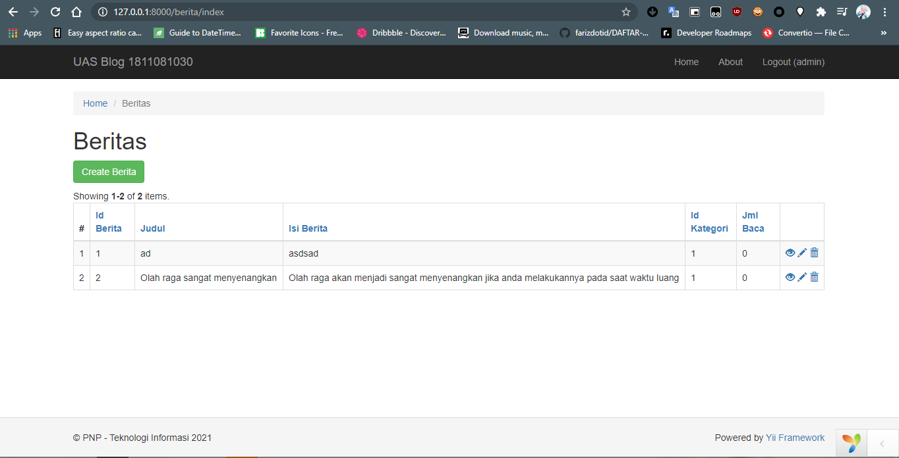
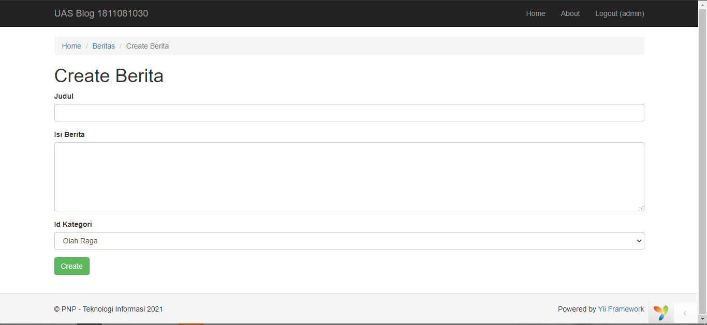
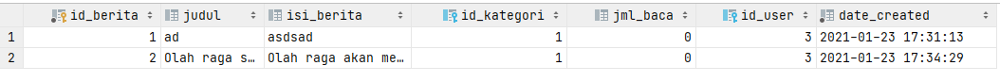

# Pembuatan Blog - Part 3

## Modifikasi hak akses halaman CRUD

-   Untuk halaman CRUD saat ini siapapun bisa mengaksesnya
    -   `/berita`
    -   `/komentar`
    -   `/kategori`
    -   `/user`
-   Maka kita akan bataskan akses tersebut hanya bisa diakses jika user login
-   Buka salah satu Controller dari **Berita**, **Komentar**, **Kategori** dan **User**
-   Edit pada bagian fungsi `behaviors` dengan menambahkan beberapa baris kode
    ```php
    public function behaviors()
    {
        return [
            'access' => [
                'class' => AccessControl::class,
                'rules' => [
                    [
                        'actions' => ['index', 'view', 'create', 'update', 'delete'],
                        'allow' => true,
                        'roles' => ['@'],
                    ]
                ]
            ],
            'verbs' => [
                'class' => VerbFilter::className(),
                'actions' => [
                    'delete' => ['POST'],
                ],
            ],
        ];
    }
    ```
-   Jika kita mengakses halaman CRUD seperti
    -   `/berita`
    -   `/komentar`
    -   `/kategori`
    -   `/user`
-   Maka otomatis akan di redirect ke halaman login
-   Jika kita sudah login maka halamannya akan tampil

    

## Modifikasi Form Berita

-   Buka file **\_form.php** di direktori `frontend/views/berita`
-   Edit pada bagian form menjadi seperti ini

    ```php
    <?php $form = ActiveForm::begin(); ?>

    <?= $form->field($model, 'judul')->textInput(['maxlength' => true]) ?>

    <?= $form->field($model, 'isi_berita')->textarea(['rows' => 6]) ?>

    <?= $form->field($model, 'id_kategori')
        ->dropDownList(ArrayHelper::map(Kategori::find()->all(), 'id_kategori', 'kategori'))
    ?>

    <div class="form-group">
        <?= Html::submitButton(
            $model->isNewRecord ? 'Create' : 'Update',
            ['class' => $model->isNewRecord ? 'btn btn-success' : 'btn btn-primary']
        )
        ?>
    </div>

    <?php ActiveForm::end(); ?>
    ```

-   Dari modifikasi diatas, jika kita mengakses `/berita/create` akan tampil seperti ini

    

-   Dengan momodifikasi form berita, maka kita harus mengedit beberapa validasi model **Berita** di direktori `common/models`
-   Edit fungsi `rules`
    ```php
    public function rules()
    {
        return [
            [['isi_berita'], 'string'],
            [['id_kategori', 'jml_baca', 'id_user'], 'integer'],
            [['date_created'], 'safe'],
            [['judul'], 'string', 'max' => 255],
        ];
    }
    ```
-   Tambahkan juga fungsi `beforeSave` pada model **Berita**. Fungsi ini akan otomatis tereksekusi ketika sebelum menyimpan data ke database

    ```php
    public function beforeSave($insert)
    {
        parent::beforeSave($insert);
        if ($this->isNewRecord) {
            $this->jml_baca = 0;
        }

        $this->date_created = date('Y-m-d H:i:s');
        $this->id_user = Yii::$app->user->id;

        return true;
    }
    ```

-   Bisa kita lihat dari fungsi tersebut akan mengisi kolom dari `date_created` dan `id_user` secara otomatis tanpa input user
-   Data yang tersimpan akan seperti ini

    
