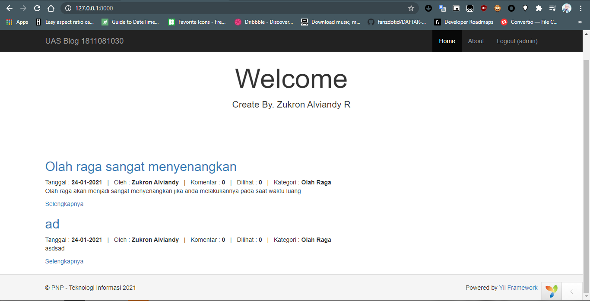
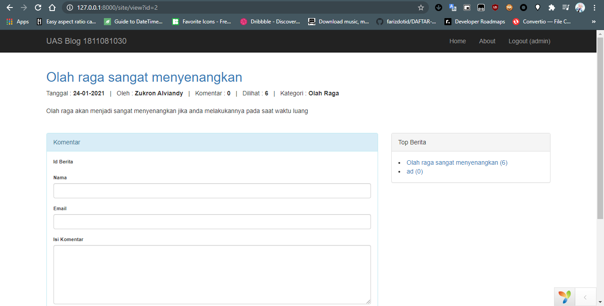

# Pembuatan Blog - Part 4

## Modifikasi halaman utama - Bagian Berita

-   Untuk menampilkan list berita nantinya di halaman utama, maka kita harus memodifikasi fungsi `actionIndex` pada Controller
-   Buka file **SiteController** di direktori `frontend/controllers`
-   Edit fungsi `actionIndex`

    ```php
    public function actionIndex()
    {
        $dataProvider = new ActiveDataProvider([
            'query' => Berita::find()->where('id_kategori != :kategori', [
                ':kategori' => isset($_GET['kategori']) ? $_GET['kategori'] : 'NULL'
            ]),
            'sort' => [
                'defaultOrder' => [
                    'id_berita' => SORT_DESC
                ]
            ]
        ]);

        return $this->render('index', [
            'dataProvider' => $dataProvider
        ]);
    }
    ```

-   Dari fungsi tersebut ada sebuah kelas `ActiveDataProvider`, kelas ini berfungsi untuk membungkus data dari database sesuai query ke view
-   Berita yang tampilpun akan terurut sesuai dengan `id_berita` yang artinya akan tampil berita terbaru
-   Buka file **index** di direktori `frontend/views/site` dan modifikasi seperti dibawah
    ```php
    <div class="body-content">
        <div class="row">
            <div class="col-lg-8">
                <?= ListView::widget([
                    'dataProvider' => $dataProvider,
                    'layout' => "{items}\n{pager}",
                    'itemOptions' => ['class' => 'item'],
                    'itemView' => '_itemBerita'
                ]);
                ?>
            </div>
        </div>
    </div>
    ```
-   Untuk layout per item dari `ListView` tersebut, maka kita buat file **\_itemBerita.php** di direktori `frontend/views/site`

    ```php
    <?php

    use yii\helpers\Html;
    ?>

    <div class="content">
        <div class="content-title">
            <h2><?= Html::a($model->judul, [
                    'view',
                    'id' => $model->id_berita
                ]) ?></h2>
        </div>
        <div class="content-detail">
            Tanggal : <strong><?= date('d-m-Y') ?></strong>
            &nbsp; | &nbsp;
            Oleh : <strong><?= $model->user->nama_depan . ' ' . $model->user->nama_belakang ?></strong>
            &nbsp; | &nbsp;
            Komentar : <strong><?= count($model->komentars) ?></strong>
            &nbsp; | &nbsp;
            Dilihat : <strong><?= $model->jml_baca ?></strong>
            &nbsp; | &nbsp;
            Kategori : <strong><?= $model->kategori->kategori ?></strong>
        </div>
        <div class="content-fill">
            <p style="text-align: justify;">
                <?= substr(strip_tags($model->isi_berita), 0, 300) ?>
            </p>
            <?= Html::a(
                'Selengkapnya',
                [
                    'view',
                    'id' => $model->id_berita
                ],
                ['class' => 'btn btn-sm btn-primary']
            ) ?>
        </div>
    </div>
    ```

-   Maka jika kita mengakses halaman utama akan seperti ini

    

## Modifikasi halaman utama - Top Berita

-   Buka file **index.php** di direktori `frontend/views/site`
-   Tambahkan baris kode di bawah tag `div` dengan kelas `col-lg-8`
    ```php
    <div class="col-lg-4">
        <div class="panel panel-default">
            <div class="panel-heading">Top Berita</div>
            <div class="panel-body">
                <ul>
                    <?php foreach (Berita::topBerita() as $row) : ?>
                        <li>
                            <?= Html::a($row->judul . ' (' . $row->jml_baca . ')', [
                                'view',
                                'id' => $row->id_berita
                            ]) ?>
                        </li>
                    <?php endforeach; ?>
                </ul>
            </div>
        </div>
    </div>
    ```
-   Buka model **Berita** dan tambahkan fungsi `topBerita`
    ```php
    public static function topBerita()
    {
        return self::find()
            ->orderBy('jml_baca DESC')
            ->limit(10)
            ->all();
    }
    ```

## Membuat halaman detail berita

-   Untuk menampilkan halam detail berita kita harus membuat fungsi baru di **SiteController**
-   Buka **SiteController** di direktori `frontend/controllers`
-   Tambahkan fungsi `actionView`

    ```php
    public function actionView($id)
    {
        $model = Berita::findOne($id);

        // menambahkan jumlah baca 1
        $model->updateCounters(['jml_baca' => 1]);

        // form komentar
        $komentarForm = new Komentar();
        if ($komentarForm->load(Yii::$app->request->post()) && $komentarForm->save()) {
            return $this->redirect(['view', 'id' => $id]);
        }

        // data provider komentar
        $dataProviderKomentar = new ActiveDataProvider([
            'query' => Komentar::find()->where(['id_berita' => $id]),
            'sort' => [
                'defaultOrder' => [
                    'id_komentar' => SORT_DESC,
                ]
            ]
        ]);

        return $this->render('view', [
            'model' => $model,
            'komentarForm' => $komentarForm,
            'dataProviderKomentar' => $dataProviderKomentar
        ]);
    }
    ```

-   Setelah fungsi dibuat kita perlu view untuk menampilkan detail dari berita
-   Buat **view.php** di direktori `frontend/views/site`

    ```php
      <?php

      use common\models\Berita;
      use yii\bootstrap\Html;
      use yii\widgets\ActiveForm;
      use yii\widgets\ListView;

      $this->title = Yii::$app->name . ' - ' . $model->judul;
      ?>

      <div class="content">
          <div class="content-title">
              <h2><?= Html::a($model->judul, [
                      'view',
                      'id' => $model->id_berita
                  ]) ?>
              </h2>
              <div class="content-detail">
                  Tanggal : <strong><?= date('d-m-Y') ?></strong>
                  &nbsp; | &nbsp;
                  Oleh : <strong><?= $model->user->nama_depan . ' ' . $model->user->nama_belakang ?></strong>
                  &nbsp; | &nbsp;
                  Komentar : <strong><?= count($model->komentars) ?></strong>
                  &nbsp; | &nbsp;
                  Dilihat : <strong><?= $model->jml_baca ?></strong>
                  &nbsp; | &nbsp;
                  Kategori : <strong><?= $model->kategori->kategori ?></strong>
              </div>
              <br>
              <div class="content-fill">
                  <?= nl2br($model->isi_berita) ?>
              </div>
          </div>
          <br><br>
          <div class="row">
              <div class="col-lg-8">
                  <div class="panel panel-info">
                      <div class="panel-heading">Komentar</div>
                      <div class="panel-body">
                          <?php $form = ActiveForm::begin([
                              'options' => [
                                  'style' => 'font-size: 80%'
                              ]
                          ]) ?>

                          <?= $form->field($komentarForm, 'id_berita')->hiddenInput(['value' => $model->id_berita])->label() ?>

                          <?= $form->field($komentarForm, 'nama')->textInput(['maxlength' => true]) ?>

                          <?= $form->field($komentarForm, 'email')->textInput(['maxlength' => true]) ?>

                          <?= $form->field($komentarForm, 'isi_komentar')->textarea(['rows' => 6]) ?>

                          <div class="form-group">
                              <?= Html::submitButton('Kirim', ['class' => 'btn btn-success']) ?>
                          </div>

                          <?php ActiveForm::end() ?>
                      </div>
                  </div>
              </div>
              <div class="col-lg-4">
                <div class="panel panel-default">
                    <div class="panel-heading">Top Berita</div>
                    <div class="panel-body">
                        <ul>
                            <?php foreach (Berita::topBerita() as $row) : ?>
                                <li>
                                    <?= Html::a($row->judul . ' (' . $row->jml_baca . ')', [
                                        'view',
                                        'id' => $row->id_berita
                                    ]) ?>
                                </li>
                            <?php endforeach; ?>
                        </ul>
                    </div>
                </div>
            </div>
          </div>
          <hr>
          <h3><i>Komentar</i></h3>
          <?= ListView::widget([
              'dataProvider' => $dataProviderKomentar,
              'layout' => "{items}\n{pager}",
              'itemOptions' => ['class' => 'item'],
              'itemView' => '_itemKomentar'
          ]) ?>
      </div>
    ```

-   Buat file **\_itemKomentar** yang akan menampilkan item-item dari komentar yang pada `ListView` di detail berita
-   Buat file di direktori `frontend/views/site`

    ```php
      <?php

      use yii\helpers\Html;
      ?>

      <div class="panel panel-success">
          <div class="panel-heading"><?= $model->nama ?></div>
          <div class="panel-body">
              <?= Html::encode($model->isi_komentar) ?>
          </div>
      </div>
    ```

-   Maka jika kita melihat detail dari salah satu berita akan tampil seperti berikut

    
